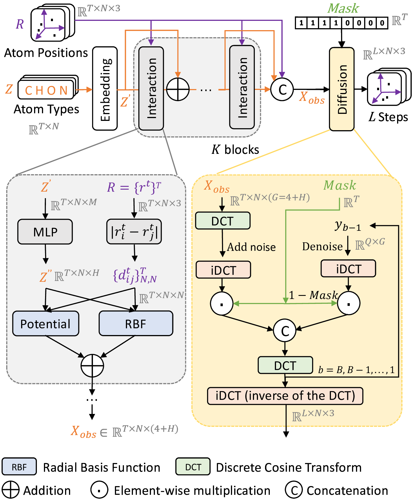

# GRAPHMD:A TWO-MODULE DIFFUSION FRAMEWORK FOR SMOOTH AND CONSISTENT MOLECULAR DYNAMICS
Source code for our 

**Task Example**: A two-module molecular dynamics simulation approach: a molecular graph interaction module enhanced with classical potential functions, and a diffusion module that leverages the Discrete Cosine Transform (DCT) to better capture smooth molecular motions.


# Approach



Overview of the proposed GraphMD. We encode temporal trajectories using the Discrete Cosine Transform (DCT) to extract dominant low-frequency motions. And we further incorporate guiding terms based on Morse and Lennard-Jones (LJ) potentials to impose soft physical constraints during graph processing, enabling the model to integrate meaningful physical priors and obtain effective guidance before adding noise during sampling.


# Download and prepare the datasets
1. Download the datasets:

   - [MD17](https://figshare.com/articles/Revised_MD17_dataset_rMD17_/12672038/3)

2. After downloading, unzip the files and place them under the `root/` directory:

```
root/
├── rmd17/
│ └── rmd17_aspirin.npz/
└── diffusion/
└── MG_interaction/
```

3. Extracting the `.npy` files.  Place all `.npy` files into the `root/` directory as follows:

```
root/
├── extracted_data/
│ └── aspirin_coord.npy/
└── rmd17/
└── diffusion/
└── MG_interaction/
```
# Dependencies
we recommend installing the following packages:

```
python == 3.8
torch == 1.8.0
schnetpack == 2.0.4
torchvision == 0.9.0
numpy == 1.24.4
tqdm == 4.67.1
torch_geometric == 2.0.4
torch-scatter == 2.0.6
torch-sparse == 0.6.10
torch-spline-conv == 1.2.1
```

# Training
You can start training our two modules by using the following two commands, respectively:

## Molecular Graph Interaction Module
```
cd /root/MG_interaction
python train.py
```

## Diffusion Module
```
cd /root/diffusion
python main.py --mode train --cfg mol
```

# Sampling


## Molecular Graph Interaction Module
```
cd /root/MG_interaction
python gen.py
```

After generating molecular graphs, you should have a ready model in `/root/diffusion/results`. Putting the graphs into `/root/diffusion/inference/result_.npy`. Then start sampling by using the following command:

## Diffusion Module
```
cd /root/diffusion
python main.py --cfg mol --mode pred  --ckpt ./results/ready_model/models/ckpt_ema.pt 
```
